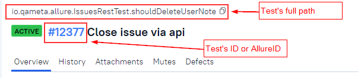

# allurectl cookbook

## Downloading allurectl

`allurectl` can be downloaded either manually and then used during the build or during the preparation stage of your build task.

In example below we download latest release linux application for linux OS with x64 CPU:

```bash
wget https://github.com/allure-framework/allurectl/releases/latest/download/allurectl_linux_amd64 -O ./allurectl
chmod +x ./allurectl

```

## Test connection

### Allure TestOps API token

Before you will be able to test the connection, you need to generate Allure TestOps secret token in your profile, so `allurectl` will be properly authenticated on Allure TestOps side.

1. Go to Allure TestOps
2. Click your avatar to invoke user menu
3. Proceed to **Your Profile**
4. Go to the section **API Tokens!**
5. Generate a new one and name it so you understand where it is used.
6. Copy Token.

### Checking the connection

This could be done from your local computer or in a CI pipeline.

To check the connection to Allure TestOps instance you can use the following command:

``` bash
$ allurectl auth login --endpoint <allure-ee-instance-endpoint> --token <access-token>
```

Alternatively, you can use environment variables

For more information use the `allurectl --help auth` command.

## allurectl working modes

There are two modes:

1. Non-CI mode
2. CI mode

### Non-CI mode

After **allurectl** started it checks whether CI specific variables are defined and if they are absent, the data upload is considered as manual upload from local PC.

There are 2 ways how you can send the parameters to allurectl:

1. Using command line parameters.
   - This option is good when you need one-time upload for some of your tests.
2. Using environment variables.
   - This option is better when you upload your data on regular basis, it is allowing you to store and reuse important parameters, so you don't need to use them in the command line every time.

#### Upload using command line parameters

```bash
allurectl upload --endpoint https://allure.company.com \
    --token 55555555-5555-5555-5555-555555555555 \
    --project-id 100 \
    --launch-name "Local PC manual launch 2200-12-31" \
    path/to/allure-results
```

#### Upload using environment variables

```bash
# Define environment variables
export ALLURE_ENDPOINT=https://allure.company.com
export ALLURE_TOKEN=55555555-5555-5555-5555-555555555555
export ALLURE_PROJECT_ID=100

# Run upload process somewhere
allurectl upload --launch-name "Local PC manual launch 2200-12-31" path/to/allure-results
```

#### What will happen

Now, what will happen if you used one of the options above:

1. A new launch with the name `Local PC manual launch 2200-12-31` will be created on Allure TestOps side
2. A new session for test results upload will be created
3. Test results from `path/to/allure-results` folder will be sent to Allure TestOps' launch `Local PC manual launch 2200-12-31` in scope of the created session.
4. Session will be closed.
5. Launch will remain open until manually closed or closed base on the automatic closure rule defined for the project `100`.

### CI mode

Each CI system has its own set of environment variables identifying it. If allurectl detects such variables, then the launch is considered as a launch from an CI system.

For a CI upload the following additional information will be included into upload and available in Allure TestOps:

1. Information about a launch
   - `launch-name` - name of the launch to be created on Allure TestOps side
   - `launch-tags` - tags for the launch to be created on Allure TestOps side
2. Information about the build job
3. Information about a job run (showed as CI system icon)

### allurectl upload workflow

#### The applicability

Use **allurectl** with the upload command **after** all your tests run. We do not recommend using allurectl upload as background process.


We recommend the usage of allurectl **watch** to send the data from CI. Use upload only in case watch is not acceptable for you.


#### The workflow (also works for watch command - see below)

Here is what happen when you execute **allurectl** with **upload** command.

1. Allure TestOps creates a new launch based on **launch-name** and **launch-tags** received from **allurectl**.
2. Based on the parameters **job-uid**, **job-name**, **job-url** received from **allurectl** Allure TestOps either selects exiting job with **job-uid** or creates a new one for **job-uid** and uses **job-name** and **job-url** for a newly created Job.
3. Based on received **job-run-uid**, **job-run-name** and **job-run-url** Allure TestOps searches for existing job run with **job-run-uid** and selects it if such job run found, or it creates a new job run with **job-run-uid** and uses **job-run-name** and **job-run-url** for the creation.
   - all the parameters from build job run from CI (e.g. parameters of GitLab pipeline or Jenkins job) are linked to **job-run-uid** in Allure TestOps.
4. Allure TestOps creates new **session**, new session is linked to **job-run**.
   - allurectl sends all environment variables to the session
   - allurectl sends all the test results to the session 

Job and job run information allows us the following

1. To understand what are the tests that were executed and what are the jobs where these test were executed.
2. Rerun failed tests for we exactly know what are the tests executed, what was the job run where these tests were executes and what are the parameters used to execute the tests in a certain job.
3. We can merge several job runs into one launch. To do so, you need to pass hob-run-uid from previous (initial) run to the current (e.g. to child job) job run.

#### The settings

The following environment variables need to be set for easier usage of `allurectl`

| Env variable      | Comment                                                                                     |
|-------------------|---------------------------------------------------------------------------------------------|
| ALLURE_ENDPOINT   | URL of Allure TestOps server                                                                |
| ALLURE_PROJECT_ID | the ID of a project in Allure TestOps, this is the 1st column of Allure TestOps main screen |
| ALLURE_TOKEN      | the user's personal access token generated in the user's profile in section **API Tokens!** |
| ALLURE_LAUNCH_NAME| Name of the launch that will be displayed in Allure TestOps UI                              |

Please refer to your [CI settings details]() to set up allurectl environments variables.

### allurectl watch workflow

Generally, **allurectl watch** does the same things which **allurectl upload** does with one important difference - **watch** command allows sending the test result in real time, i.e. you don't need to wait till all the tests are completed and that will decrease the workload and hasten the test results processing on Allure TestOps side.

**allurectl watch** is a wrapper for your test execution, i.e. you need to provide the command which you are using to execute your tests to **allurectl watch**.

#### The usage

As usual you need to provide **parameters** needed for **the connection to Allure TestOps** server (in the example below these are the environment variables, and we strongly recommend you using the environment variables to pass these parameters to allurectl), then you show allurectl where you're expecting the test results to appear and then provide the command to start tests execution.

```bash
export ALLURE_ENDPOINT=https://allure.company.com
export ALLURE_TOKEN=55555555-5555-5555-5555-555555555555
export ALLURE_PROJECT_ID=100
export ALLURE_LAUNCH_NAME="Hello, world" # you can use here the environment variables of your job/pipeline
...
allurectl watch --results path/to/allure-results -- ./gradlew clean test
```

alternatively, you can provide all the start parameters in the environment variables, so the **watch** will look prettier and concise:

```bash
export ALLURE_ENDPOINT=https://allure.company.com
export ALLURE_TOKEN=542dcd56-b0e2-4fdd-8ecf-bacf0f33d505
export ALLURE_PROJECT_ID=12
export ALLURE_LAUNCH_NAME="Hello, world"
export ALLURE_RESULTS=path/to/allure-results
...
allurectl watch -- ./gradlew clean test
```

## Tests rerun and selective run with allurectl

The most important thing with test rerun and selective run is the **test plan**. In this particular case when we're talking about the selective run and rerun (rerun is actually is a special case for selective run) the **test plan** is a **file** (specifically, it's **testplan.json**) with the **list of test cases**, that your test framework needs to run.

Now, let's discuss how this integration works.

### Selective tests run integration

1. On Allure TestOps side we create a **list of test cases** we need to **(re)run** on CI side. Each test case is identified by AllureID and a selector. Selector is the way test framework identifies certain test, generally it is the combination of package name, class name and method name but can be test framework dependant.
2. The list of test cases is then saved to CI into **testplan.json**
3. On CI side we create an environment variable **ALLURE_TESTPLAN_PATH** and set the value to the **path to testplan.json** file
4. When your project with tests is being executed, then Allure TestOps integration with test framework checks if **ALLURE_TESTPLAN_PATH** is available
   1. If the variable **ALLURE_TESTPLAN_PATH** is available, the integration tries to find the file **testplan.json** using **ALLURE_TESTPLAN_PATH** value
   2. If the file **testplan.json** is successfully read, then the integration instructs the test framework to run only the tests specified in the **testplan.json**.

If CI starts all tests from your project, then either something is not configured on your side or your test framework has no integration with Allure TestOps.
If you are facing this, please file a support (not a bug) request to our [technical support.](https://help.qameta.io)

#### testplan.json structure

The testplan.json file looks like follows.

Knowing this structure, you can create testplan.json on your local PC, initialize the environment variable **ALLURE_TESTPLAN_PATH** with path to **testplan.json** and run your tests locally without any additional filters in the same session, if only tests from **testplan.json** will run, then you have the working integration for selective run, otherwise you need to configure the integration or [develop it for your test framework.](https://help.qameta.io)

```json

{
  "version":"1.0",
  "tests": [
    {
      "id": "10",
      "selector": "io.qameta.allure.examples.junit4.AllureSimpleTest.allureSimpleTest"
    },
    {
      "id": "11",
      "selector": "io.qameta.allure.examples.junit4.AllureParameterizedTest.allureParameterizedTest[First Name]"
    }
  ]
}

```

where

- **id** is the test ID (Allure ID) from Allure TestOps
- **selector** is the alternative ID which is equal to test's full path by default.
  - we're planning to extend the information provided in the selector
  

### Saving the test plan to CI, run tests and upload the tests results

In all CIs we have the same sequence:

1. Allure TestOps starts a Job and adds **ALLURE_JOB_RUN_ID** = <id> to the job.
   - if allurectl detects **ALLURE_JOB_RUN_ID** then it ignores all other variables an session is created in the Job run set by Allure TestOps.
2. Allure TestOps provides the environment variable **ALLURE_TESTPLAN_PATH: ./testplan.json** to the job run.
3. **allurectl** creates **testplan.json** and fills it with the information about the list of the tests.
   - this is done using the command `allurectl job-run plan --output-file ${ALLURE_TESTPLAN_PATH}`
4. allurectl executes your tests and makes the index list of the test results files and send the tests results files to Allure TestOps using **watch** command
   - `allurectl watch -- ./gradlew clean test`
